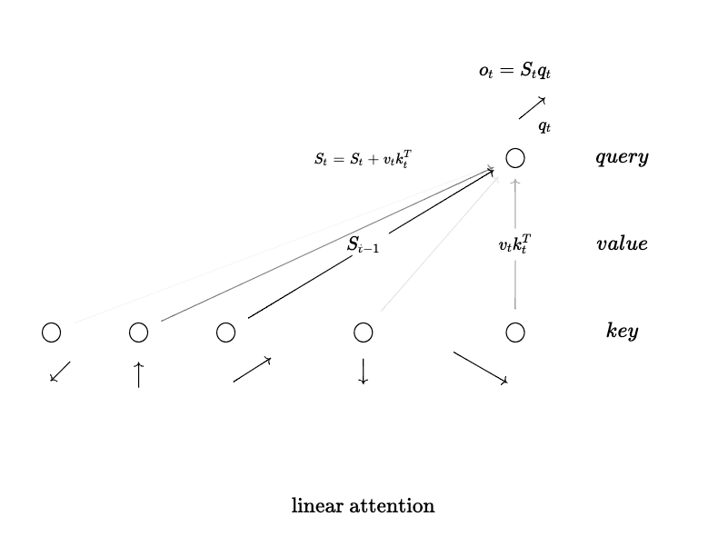
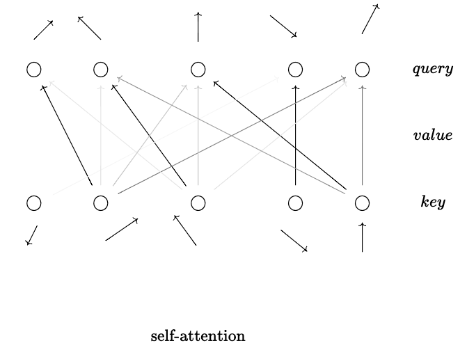

# Latex Diagrams for Machine Learning

### This is a collection of diagrams, mostly made with [quiver](https://github.com/varkor/quiver). Feel free to use as you please. 

Here are some examples:

